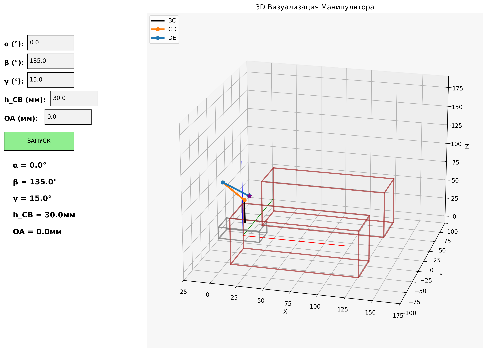

# 5-Degrees-of-Freedom Manipulator Visualization

Python va matplotlib yordamida yaratilgan interaktiv 3D robotik manipulyator vizualizatsiyasi. Real vaqtda parametrlarni o'zgartirish va animatsiya imkoniyatlari bilan.



## Loyiha haqida

Bu loyiha 5 erkinlik darajali robotik manipulyatorning to'liq 3D vizualizatsiyasini ta'minlaydi. Forward kinematics algoritmi asosida ishlab, real vaqtda parametrlarni o'zgartirish va silliq animatsiya imkoniyatlarini beradi.

### Asosiy xususiyatlar:

- **5-DoF Manipulyator**: To'liq kinematik zanjir (BC, CD, DE bo'g'inlari)
- **Interaktiv boshqaruv**: α, β, γ burchaklari va h_CB, OA parametrlarini real vaqtda sozlash
- **Silliq animatsiya**: Parametrlar o'zgarishida yumshoq o'tish effektlari
- **3D muhit simulyatsiyasi**: Harakatlanuvchi platforma va qo'zg'almas to'siqlar
- **Real vaqt vizualizatsiya**: Matplotlib 3D plotting bilan professional ko'rinish

## Texnik spetsifikatsiyalar

### Erkinlik darajalari (DoF):
- **α (Alpha)**: Asosiy aylanish burchagi (Z o'qi atrofida)
- **β (Beta)**: Egilish burchagi (vertikal tekislikda)
- **γ (Gamma)**: End effector orientatsiya burchagi
- **h_CB**: Vertikal ko'tarish (prizmatik harakat)
- **OA**: Gorizontal siljish (prizmatik harakat)

### Vizual komponentlar:
- **Koordinata tizimi**: X (qizil), Y (yashil), Z (ko'k) o'qlari
- **Manipulyator bo'g'inlari**: 
  - BC: Qora rang (asosiy bo'g'in)
  - CD: To'q sariq rang (o'rta bo'g'in)
  - DE: Ko'k rang (oxirgi bo'g'in)
- **End effector**: Binafsha yulduzcha belgisi
- **Platforma**: Kulrang parallelepiped (harakatlanuvchi)
- **Pomidor qatorlari**: Jigarrang parallelepiped strukturalar (issiqxona qatorlari)

## O'rnatish va ishga tushirish

### Talablar:
```bash
pip install numpy matplotlib
```

### Ishga tushirish:
```bash
python test-1-manipulator.py
```

## Foydalanish bo'yicha ko'rsatma

### Boshqaruv interfeysi:
1. **Parametr kiritish**: Chap paneldagi matn maydonlariga yangi qiymatlarni kiriting
2. **Animatsiya boshlash**: "ЗАПУСК" tugmasini bosing
3. **Real vaqt kuzatish**: Manipulyator silliq ravishda yangi pozitsiyaga o'tadi

### Parametr chegaralari:
- **α**: 0° - 360° (aylanish burchagi)
- **β**: -180° - 180° (egilish burchagi)
- **γ**: -90° - 90° (orientatsiya burchagi)
- **h_CB**: 0 - 100 mm (vertikal ko'tarish)
- **OA**: -50 - 50 mm (gorizontal siljish)

## Matematik model

### Forward Kinematics:
Loyiha forward kinematics algoritmini qo'llaydi:

```
Ex = OA + L * (cos(α) * cos(β) - cos(α) * cos(γ + β))
Ey = L * (sin(α) * cos(β) - sin(α) * cos(γ + β))
Ez = L * (sin(β) - sin(γ + β)) + h_CB
```

### Konstantalar:
- **L**: Bo'g'in uzunligi (30.0 mm)
- **h_DC**: DC bo'g'in balandligi (30.0 mm)

## Loyiha tuzilishi

```
manipulator-5dof-viz/
├── test-1-manipulator.py    # Asosiy dastur fayli
├── .kiro/                   # Kiro IDE konfiguratsiyalari
│   └── steering/
│       └── design-system.md # Dizayn tizimi qoidalari
├── .gitignore              # Git ignore qoidalari
└── README.md               # Loyiha hujjatlari
```

## Texnik implementatsiya

### Kutubxonalar:
- **numpy**: Matematik hisob-kitoblar va matritsalar
- **matplotlib**: 3D vizualizatsiya va plotting
- **mpl_toolkits.mplot3d**: 3D koordinata tizimi
- **matplotlib.widgets**: Interaktiv UI elementlari

### Arxitektura:
- **Modular dizayn**: Alohida funksiyalar har bir komponent uchun
- **Real-time yangilanish**: Samarali animatsiya algoritmi
- **3D rendering**: Matplotlib 3D engine asosida
- **Event-driven**: Widget-based foydalanuvchi interfeysi

## Qo'llanish sohalari

- **Qishloq xo'jaligi robotikasi**: Issiqxonalarda pomidor terim jarayoni
- **Ta'lim**: Robotika va kinematika o'rgatish
- **Tadqiqot**: Manipulyator harakati tahlili
- **Prototiplash**: Qishloq xo'jaligi robotik tizimlar dizayni
- **Simulyatsiya**: Virtual issiqxona muhitida sinov o'tkazish

## Kelajakdagi rivojlanish

- Inverse kinematics qo'shish
- Trajectory planning algoritmlari
- Collision detection tizimi
- Export/import konfiguratsiya fayllari
- 6-DoF manipulyatorga kengaytirish

## Litsenziya

Bu loyiha ochiq kodli hisoblanadi va ta'lim maqsadlarida erkin foydalanish mumkin.

## Muallif

Robotik manipulyator vizualizatsiya tizimi - Python va matplotlib texnologiyalari asosida yaratilgan.

---

# 5-Degrees-of-Freedom Manipulator Visualization

Interactive 3D robotics manipulator visualization built with Python and matplotlib, featuring real-time parameter control and smooth animation capabilities.


## About the Project

This project provides a complete 3D visualization of a 5-degrees-of-freedom robotic manipulator. Built on forward kinematics algorithms, it offers real-time parameter adjustment and smooth animation capabilities.

### Key Features:

- **5-DoF Manipulator**: Complete kinematic chain (BC, CD, DE joints)
- **Interactive Control**: Real-time adjustment of α, β, γ angles and h_CB, OA parameters
- **Smooth Animation**: Soft transition effects during parameter changes
- **3D Environment Simulation**: Moving platform and stationary obstacles
- **Real-time Visualization**: Professional appearance with matplotlib 3D plotting

## Technical Specifications

### Degrees of Freedom (DoF):
- **α (Alpha)**: Primary rotation angle (around Z-axis)
- **β (Beta)**: Bending angle (in vertical plane)
- **γ (Gamma)**: End effector orientation angle
- **h_CB**: Vertical lift (prismatic motion)
- **OA**: Horizontal displacement (prismatic motion)

### Visual Components:
- **Coordinate System**: X (red), Y (green), Z (blue) axes
- **Manipulator Joints**: 
  - BC: Black color (base joint)
  - CD: Orange color (middle joint)
  - DE: Blue color (end joint)
- **End Effector**: Purple star marker
- **Platform**: Gray parallelepiped (movable)
- **Tomato Rows**: Brown parallelepiped structures (greenhouse rows)

## Installation and Setup

### Requirements:
```bash
pip install numpy matplotlib
```

### Running:
```bash
python test-1-manipulator.py
```

## Usage Guide

### Control Interface:
1. **Parameter Input**: Enter new values in the text fields on the left panel
2. **Start Animation**: Click the "ЗАПУСК" button
3. **Real-time Monitoring**: Watch the manipulator smoothly transition to new position

### Parameter Ranges:
- **α**: 0° - 360° (rotation angle)
- **β**: -180° - 180° (bending angle)
- **γ**: -90° - 90° (orientation angle)
- **h_CB**: 0 - 100 mm (vertical lift)
- **OA**: -50 - 50 mm (horizontal displacement)

## Mathematical Model

### Forward Kinematics:
The project implements forward kinematics algorithm:

```
Ex = OA + L * (cos(α) * cos(β) - cos(α) * cos(γ + β))
Ey = L * (sin(α) * cos(β) - sin(α) * cos(γ + β))
Ez = L * (sin(β) - sin(γ + β)) + h_CB
```

### Constants:
- **L**: Joint length (30.0 mm)
- **h_DC**: DC joint height (30.0 mm)

## Project Structure

```
manipulator-5dof-viz/
├── test-1-manipulator.py    # Main program file
├── .kiro/                   # Kiro IDE configurations
│   └── steering/
│       └── design-system.md # Design system rules
├── .gitignore              # Git ignore rules
└── README.md               # Project documentation
```

## Technical Implementation

### Libraries:
- **numpy**: Mathematical calculations and matrices
- **matplotlib**: 3D visualization and plotting
- **mpl_toolkits.mplot3d**: 3D coordinate system
- **matplotlib.widgets**: Interactive UI elements

### Architecture:
- **Modular Design**: Separate functions for each component
- **Real-time Updates**: Efficient animation algorithm
- **3D Rendering**: Based on matplotlib 3D engine
- **Event-driven**: Widget-based user interface

## Application Areas

- **Agricultural Robotics**: Tomato harvesting process in greenhouses
- **Education**: Teaching robotics and kinematics
- **Research**: Manipulator motion analysis
- **Prototyping**: Agricultural robotic system design
- **Simulation**: Testing in virtual greenhouse environment

## Future Development

- Adding inverse kinematics
- Trajectory planning algorithms
- Collision detection system
- Export/import configuration files
- Extension to 6-DoF manipulator

## License

This project is open source and free to use for educational purposes.

## Author

Robotic manipulator visualization system - built with Python and matplotlib technologies.